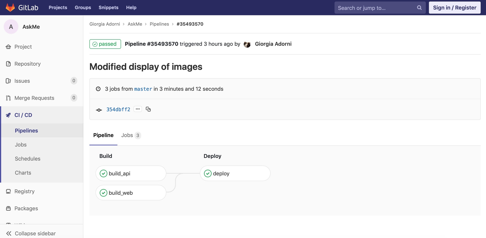
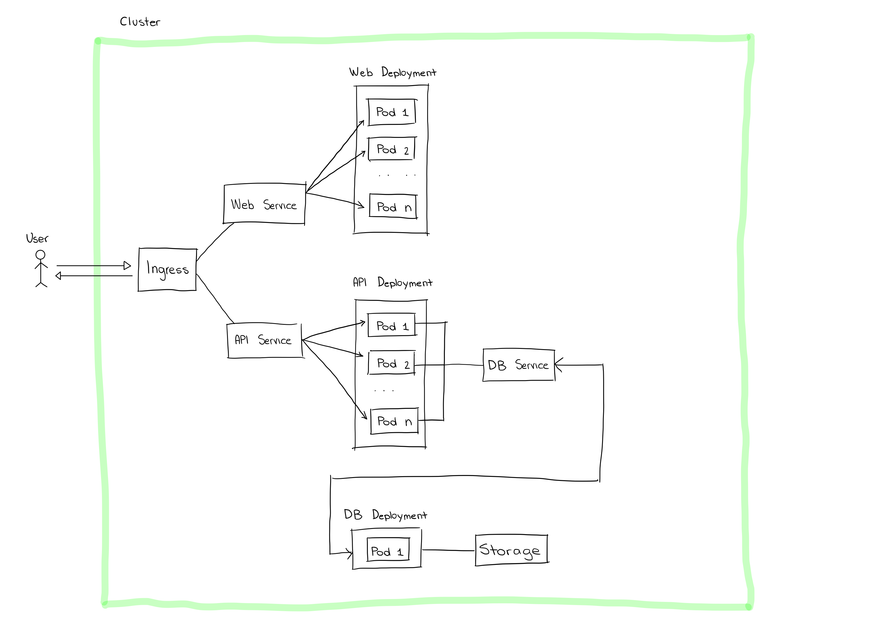

# AskMe

AskMe is a simple Q&A application built on the model of StackOverflow. It
supports asking questions, posting answers and up- or down-voting existing answers.

The running web app is available at
[https://askme.cereda.me/](https://askme.cereda.me/).

Dire qualcosa riguardo il fatto che l'app non sia sempre online a causa del 
pagamento di google cloud.

#### Repository
The source code is available on GitLab at
[https://gitlab.com/GiorgiaAuroraAdorni/askme/](https://gitlab.com/GiorgiaAuroraAdorni/askme/).

#### Contributors
This project has been developed by Giorgia Adorni (806787) and Elia Cereda (807539).

#### DevOps aspects
We decided to address three aspects of the DevOps process:

1. Containerization  
2. Continuous Integration / Continuous Deployment  
3. Provisioning

## Architecture
The application has a distributed architecture composed of three main components:
* **web interface:** a client-side web application built with React, through which 
the users interact with the platform.
* **API server:** a web service built using Python and the Flask microframework 
that exposes the REST API used by the frontend.
* **database:** a PostgreSQL instance responsible for persistently storing 
the users' data.

## Development setup
Thanks to Docker Compose, the process of setting up a local development
environment is extremely streamlined. These three commands are all that it's 
needed to spin up and debug the application:

```
$ git clone https://gitlab.com/GiorgiaAuroraAdorni/askme.git
$ cd askme
$ docker-compose up
```

The web interface will be available at [http://localhost:3000/](http://localhost:3000/)
and the API server will be available at [http://localhost:5000/api/](http://localhost:5000/api/).
In addition, our `docker-compose.yml` file also starts an instance of pgAdmin to
access the database directly: you can reach it at [http://localhost:5005/](http://localhost:5005/).

Docker Compose also allows to locally run the unit tests for both the web interface and API server:

```
$ docker-compose run api python -m pytest
$ docker-compose run web npm test
```

## Containerization
We use Docker to containerize each of the three components. This allows us to 
simplify the setup process of the development environment and to create deployable 
images that contain all dependencies needed by a component. 

We wrote the `Dockerfile`s to take advantage of
[multi-stage builds](https://docs.docker.com/develop/develop-images/multistage-build)
and build arguments to be able to produce two types of images from a single 
configuration: full-featured development images with compilers, debugger support
and live code reloading and slimmed down production images that include just 
the bare minimum required to execute the application.

For example, the web interface requires Node.js and a large number of other
dependencies during development and compilation, while only requiring a static
web server (such as Nginx) in production. Copying only the compiled files to 
production allowed us to create extremely small and efficient images.


## Continuous Integration / Continuous Deployment
We wrote tests for the API server with pytest and for the web interface with the
tools provided by React.

Using GitLab CI, we have set up a pipeline of Continuous Integration that runs after every commit: 
 * building Docker images
 * running unit tests  
 * publishing images to GitLab Container Registry

With Continuous Deployment, commits that successfully pass all stages of the CI pipeline 
are published to the production environment automatically.
This ensures that only functioning builds are released to the customers.



In `.gitlab-ci.yml` file we configure the three stages of our pipeline: build, test, and deploy.
On any push GitLab will look for the `.gitlab-ci.yml` file and start jobs on Runners 
according to the contents of the file, for that commit.

GitLab interface provides a visualization of the pipeline status. 
This screen displays the deployment history, and allows re-deployment and rollback.


## Provisioning
We originally planned to deploy our application to a shared Kubernetes cluster
offered by [GARR Cloud](https://cloud.garr.it/containers/). Unfortunately, due 
to the multi-tenant nature of the cluster, we didn't have the authorizations to 
perform some actions and we needed assistance from GARR. The most significant 
problem we encountered was provisioning persistent storage for our database in 
Kubernetes.

Since the deadline for this assignment coincided with the week of November 1st, 
we couldn't get an answer in time from GARR and we decided to use another service 
to deploy our application.

We choose to use Google Cloud for two main reasons:
 * They offer a very strong managed service, called 
   [Google Kubernetes Engine](https://cloud.google.com/kubernetes-engine/), that
   allows to run containerized applications without having to manually install a
   Kubernetes cluster. It natively supports auto-scaling for both Pods and Nodes, 
   even across multiple zones in a Google Cloud region for fault tolerance and
   high availability.
 * They use an attractive pricing scheme that includes 300$ of credit for new 
   users and no charge for using GKE beyond the cost of the virtual machines 
   used as Kubernetes Nodes.
   
The `k8s/` folder in the repository contains the Kubernetes manifests we used to
set up our cluster and some shell scripts we wrote to manage it:
 * `gke-cluster-create.sh` creates a Kubernetes cluster with a single node on GKE
 * `gke-cluster-pause.sh` pauses an existing cluster to avoid being charged when not needed
 * `gke-cluster-resume.sh` resumes the cluster by recreating the resources that were deleted 
 * `deploy.sh` is used by our CI/CD pipeline to update the images used by an existing deployment

This diagram describes the architecture of our production environment:


### Pods
Pods are the smallest deployable object represented by Kubernetes: they represent
a number of containers that are guaranteed to be scheduled on the same Node. 
Attached to a Pod are also the resources needed by its containers, such as storage
volumes and IP addresses. In our case, each Pod runs a single container.

### Deployments
Deployments describe the desired state of a group of Pods. In particular they 
specify what Docker image should be used and how many replicas of a Pod should 
be scheduled. A Deployment monitors its Pods and acts to maintain the desired 
state: it's able to restart crashed Pods and to perform rolling updates of its
Pods.

For the web and API Deployments this means being able to schedule whatever 
number of Pods is required and seamlessly update the images with zero downtime
for users. If we enabled auto-scaling, it would also be possible to dynamically 
spin up and shutdown Pods based on the real-time load.

Since the database is a stateful application, achieving scalability is harder 
than with the other components and it would require cooperation from the DBMS. 
At the moment our Deployment can only schedule a single database instance.

### Services
Services provide an abstraction over a set of Pods that expose a certain functionality.
It allows clients to use a single endpoint, a combination of a virtual IP address
and a port, to access the service while Kubernetes distributes requests among
the specific Pods providing it.

Inside the cluster, Kubernetes also provides a dynamic DNS record for each 
Service that can be used to access it: `db-service`, `api-service`, `web-service`.

### Ingress
The Ingress provides a single access point for users to connect to the cluster. 
In the Google Cloud implementation, this is an extremely powerful component and 
it's almost overkill for our purposes. Its features include:
* **Global load balancing** that receives traffic on a single anycast IP address
  and distributes it to the Google Cloud region closest to the user, with 
  automatic fail-over should a region become unavailable. Given that we only run
  our cluster in a single region we're not able to take advantage of this.
* **HTTPS termination** with automatic certificate provisioning from Let's 
  Encrypt, which allowed us to secure our application with HTTPS at no extra cost
  and with no changes to our application code.
* **URL-based mapping** that allows to map requests to the corresponding service
  based on its URL. We forward requests that begin with `askme.cereda.me/api/` to
  our API server and all other requests to our web server. 

## Future developments

DB replication
Autoscaling

At present, no monitoring activity is carried out, even if, using some tools 
integrated with Google Cloud, it's possible to conduct analysis and management 
of services/containers/applications.

1. **Uptime monitoring**: the tool (Stackdriver Monitoring) allows the display/visualization of 
significant/meaningful information, automatically collected, such as performance, activity 
time and overall status of applications running in the cloud environment, in the 
form of dashboards, graphs and alerts.

2. **Logging**: the tool (Stackdriver Logging) allows to store, search, analyze 
in real time and create alerts for data and events of Google Cloud Platform logs.

3. **Debugger**: the tool (Stackdriver Debugger) links/connects the production data 
to the source code, analyzing in real time status and functionality 
of the application running in the production environment, without stopping or 
slowing down requests (users don't suffer slowdowns).
This's useful for understanding the behavior of the code in production, 
and for analyzing its status in order to find hard-to-find bugs.
